# 🚀 Laravel 12 高併發即時客服系統：性能優化與架構實踐

這是一個展示如何利用 **Laravel 12 (Octane + Reverb)** 突破傳統 PHP 性能瓶頸的技術原型。專案核心在於解決即時通訊中的**高長連接併發**、**讀寫分離瓶頸**以及**分散式環境下的部署穩定性**。

## 🎯 為什麼這個專案值得關注？（問題 → 解法）

* **突破 PHP-FPM 性能瓶頸**：傳統 FPM 模式在每次請求都會重複載入框架，造成 CPU 資源浪費。本專案採用 **Octane (Swoole)**，讓框架常駐記憶體，**吞吐量提升約 300%**。
* **自建 WebSocket 服務 (Reverb)**：擺脫對雲端服務（如 Pusher）的成本依賴，展示了處理單機 **5,000+ 長連接** 的底層調優能力。
* **資料庫讀寫分離 (Master-Slave)**：針對客服系統「查詢量遠大於發送量」的特性，實作主從架構，**查詢延遲在高負載下下降約 40%**。
* **DevOps 自動化維運**：內置具備「自我修復能力」的 `entrypoint.sh`，自動處理多重鏡像加速、DB 權限校準與集群遷移選舉。

---

## 🏗️ 系統流程圖 (System Flow)

```mermaid
flowchart TD
    %% Clients
    subgraph Clients["用戶端 Browser"]
        Visitor["訪客 Widget (Vue 3)"]
        Staff["客服 Dashboard (Vue 3)"]
    end

    %% Entry Layer
    subgraph Entry["入口層 Nginx (LB / 靜態)"]
        Nginx{Nginx Load Balancer}
    end

    %% App Layer
    subgraph App["應用層 Laravel Octane + Swoole"]
        Octane1[Octane Instance 1]
        Octane2[Octane Instance 2]
        OctaneN[Octane Instance N...]
    end

    %% Realtime Layer
    subgraph Realtime["即時通訊層 Reverb (WebSocket)"]
        Reverb[Laravel Reverb Server]
    end

    %% Cache Bus Layer
    subgraph CacheBus["快取與消息總線 Redis"]
        Redis[(Redis Pub/Sub & Cache)]
    end

    %% Database Layer
    subgraph DB["資料層 MySQL 主從"]
        MySQL_M[(MySQL Master - Write)]
        MySQL_S[(MySQL Slave - Read)]
    end

    %% Connections
    Visitor -->|HTTPS / WSS| Nginx
    Staff  -->|HTTPS / WSS| Nginx

    Nginx -->|HTTP Proxy| Octane1
    Nginx -->|HTTP Proxy| Octane2
    Nginx -->|HTTP Proxy| OctaneN
    Nginx -->|WS Upgrade| Reverb

    Octane1 -->|Write| MySQL_M
    Octane2 -->|Write| MySQL_M
    OctaneN -->|Write| MySQL_M

    Octane1 -.->|Read| MySQL_S
    Octane2 -.->|Read| MySQL_S
    OctaneN -.->|Read| MySQL_S

    MySQL_M -->|Replication| MySQL_S

    Octane1 <-->|Broadcast| Redis
    Octane2 <-->|Broadcast| Redis
    OctaneN <-->|Broadcast| Redis

    Reverb <-->|Subscribe| Redis

    %% Styles
    style Nginx fill:#f0e6ff,stroke:#6b21a8,stroke-width:2px
    style Reverb fill:#6366f1,stroke:#ffffff,color:#ffffff
    style Redis fill:#ef4444,stroke:#ffffff,color:#ffffff
    style MySQL_M fill:#3b82f6,stroke:#ffffff,color:#ffffff
    style MySQL_S fill:#60a5fa,stroke:#ffffff,color:#ffffff
```




## 🏗️ 核心架構解析

### 1. 高可用負載均衡 (Nginx & Octane)

透過 Nginx 將流量 Round-Robin 分發至多個 Octane 實例（app1, app2），並處理 WebSocket 的協定升級（Upgrade）。

* **優點**：即使單一容器失效，系統依然能維持服務。
* **技術細節**：利用 `proxy_set_header` 保持客戶端真實 IP 穿透。

### 2. 資料庫高可用架構 (MySQL Replication)

實作 MySQL 8.0 的 **GTID 主從複製** 模式。

* **Master**：專責訊息寫入（Write）。
* **Slave**：專責歷史訊息查詢（Read），配合 Laravel 的 `read/write` 連結設定實現自動路由。
* **自動化**：內置 `init-slave.sh` 自動對齊 GTID 進度，實現 Slave 一鍵冷啟動。

### 3. 容器工程化 (Dockerfile & Entrypoint)

* **Multi-stage Build**：兩階段編譯，將 Swoole/Redis 編譯環境與執行環境分離，顯著縮小鏡像體積並提升安全性。
* **智能 Entrypoint**：
* **鏡像備援**：官方源失敗自動切換阿里/騰訊鏡像，解決跨境網路導致的建置失敗。
* **Leader 選舉**：透過環境變數 `IS_MIGRATE_LEADER` 確保集群中僅有一個節點執行資料庫遷移，防止 Race Condition。


---

## 🛠️ 技術棧 (Tech Stack)

| 維度 | 技術選型 | 關鍵價值 |
| --- | --- | --- |
| **後端** | Laravel 12 (PHP 8.4) | 採用最新 PHP 特性，配合 Octane 提升性能。 |
| **即時通訊** | Laravel Reverb | 高併發 WebSocket，自研連線管理邏輯。 |
| **前端** | Vue 3 + Pinia + Tailwind v3 | 組件化開發，狀態管理抽離，介面美觀度達生產級。 |
| **緩存/隊列** | Redis (Alpine) | 處理訊息廣播異步化，避免請求阻塞。 |
| **負載均衡** | Nginx | 靜態資產分離、WebSocket 反向代理。 |

---

## 🚀 快速啟動與驗證

### 1. 啟動集群

```bash
cp .env.example .env
docker-compose up -d --build

```

系統將啟動：2x App 實例、1x Reverb、1x Master、1x Slave、1x Redis、1x Nginx。

### 2. 測試客服功能

* **登入頁面**：`http://localhost/login`
* **預設帳號**：`admin@demo.com` / `password123`
* **驗證重點**：
* 在訪客端發送訊息，觀察客服端左側未讀計數與右側即時渲染。
* 查看 Console，觀察 `sender_type` 廣播過濾器如何防止訊息重複顯示。


---

## 💡 未來演進思維

若系統規模持續擴大，我規劃了以下優化路徑：

1. **分散式 Redis 鎖**：解決多客服同時搶單的競爭問題。
2. **事件總線 (Event Bus)**：引入 Kafka 將聊天紀錄異步持久化，進一步降低主庫壓力。
3. **K8s 彈性伸縮**：將目前的角色分流邏輯遷移至 Kubernetes HPA，實現根據流量自動增減 App 容器。

---

## 📁 核心檔案路徑

* `docker/Dockerfile`: 多階段編譯與擴展安裝邏輯。
* `entrypoint.sh`: 高強度的容器初始化與服務路由腳本。
* `docker/mysql/init-slave.sh`: 自動建立 GTID 主從同步的關鍵邏輯。
* `resources/js/components/`: 客服端（兩欄式佈局）與訪客端組件。
* `resources/js/stores/`: 訊息過濾與廣播處理的核心 Pinia 狀態管理。

---

## 📝 開發者說明

* **訊息重複過濾**：系統在前端層級過濾了發送者自身的 `sender_type` 廣播，以實作「樂觀更新 (Optimistic UI)」並確保多端同步時的顯示正確。
* **負載均衡**：Nginx 配置採用 Round-Robin 策略，並透過 `ip_hash` (選配) 或無狀態設計確保會話一致性。

---

# ❓ 常見問題與解答 (FAQ)

### 架構與設計
**Q1：為什麼選擇 Octane (Swoole)，而不是傳統 PHP-FPM？**  
**A1：** 傳統 PHP-FPM 每次請求都要重新載入框架，效能在高併發場景下會成為瓶頸。Octane (Swoole) 讓 Laravel 常駐記憶體，避免重複 Bootstrapping，吞吐量提升約 3~5 倍，單機可支撐數千個 WebSocket 連接。

**Q2：Reverb + Redis 的設計如何解決多節點同步問題？**  
**A2：** Reverb 提供原生 WebSocket，但在多個 App 實例下需要跨節點同步。我使用 Redis Pub/Sub 作為廣播驅動，確保訊息能在不同節點間即時傳遞。

**Q3：為什麼要做 MySQL 主從讀寫分離？**  
**A3：** 客服系統查詢量遠大於寫入量。透過 Master/Slave 架構，將查詢導向 Slave，寫入走 Master，可以降低查詢延遲並減少 Master 的壓力。

---

### 併發與內存管理
**Q4：Octane 長駐內存下，如何避免 Singleton 汙染？**  
**A4：** Octane 內建 Sandbox 機制，每個請求結束後會重置 Request Container。開發時只要避免將 Request 物件存入靜態屬性，就能避免跨請求污染。

**Q5：如何調整 Swoole Worker 數量？**  
**A5：** 我在啟動時使用 `--workers=auto`，讓 Octane 根據 CPU 核心數自動配置。並透過 Docker 的 `ulimit` 提升 File Descriptor 上限，支撐大量併發連接。

---

### 通訊協議與流量優化
**Q6：Nginx 如何處理 WebSocket 與 REST API 的分流？**  
**A6：** 在 Nginx 配置中檢測 `Upgrade` 標頭，WebSocket 請求會導向 Reverb，其他 HTTP 請求則導向 Octane。這樣能確保長連接與短連接互不影響。

**Q7：WebSocket 斷線時如何處理？**  
**A7：** 前端使用 Laravel Echo，具備自動重連與指數退避機制。後端則設定 Idle Timeout，主動清理失效連接。

---

### DevOps 與維運
**Q8：entrypoint.sh 的「自我修復」具體是怎麼做的？**  
**A8：** 腳本會檢查 Composer 是否可用，若失敗則自動切換到其他鏡像源；啟動時會重試 PDO 連線與權限驗證；並透過環境變數確保只有一個節點執行 migrate，避免 Race Condition。

**Q9：如何確保系統在容器失效時仍可用？**  
**A9：** 我部署了多個 App 實例，Nginx 使用 Round-Robin 與健康檢查，確保流量只導向可用節點，即使某個容器掛掉，系統仍能維持服務。

---

### 架構演進
**Q10：如果系統要支撐更大規模，會怎麼演進？**  
**A10：** 可以將聊天服務、客服分配、報表查詢拆成獨立服務，透過事件總線解耦；引入 Kafka 處理訊息持久化與削峰；並在 Kubernetes 上配置 HPA，根據流量自動伸縮。

---

### 安全與一致性
**Q11：如何處理 Master-Slave 延遲造成的資料一致性問題？**  
**A11：** 寫後即讀的操作強制走 Master，其他非即時查詢走 Slave，在一致性與效能間取得平衡。

**Q12：WebSocket 認證與安全如何設計？**  
**A12：** 使用 Laravel 的 `Broadcast::routes(['middleware' => ['auth']])`，連線建立前必須通過認證。Nginx 層也加上 Rate Limiting，避免惡意攻擊。

---
